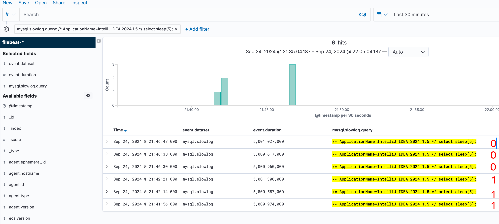

## MySQL slow query logs with ELK and Kibana

Using Kibana instead of Graylog as it's better in use with Elasticsearch.

### Testing demo
1. `docker-compose up -d`
2. Connect to mysql database `jdbc:mysql://localhost:3306/test_database` and perform query `select sleep(5);`. `long_query_time` defines the threshold = logs will be considered slow if query_time > long_query_time.
3. MySQL logs will be collected by filebeat. ELK will create an index for that filebeat. Kibana is connected to ELK and will take filebeat logs.
4. Observe logs in Kibana
